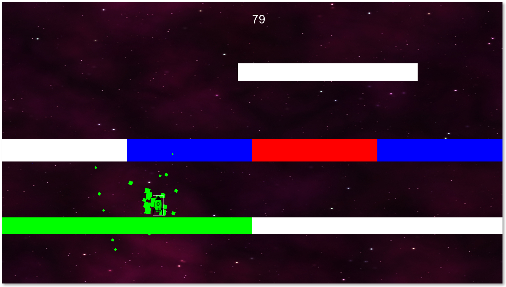

# rust-sfml-rocket 

> Rocket is a little game written in Rust, using the Rust-SFML library.

## Gameplay

## How to play

You play as a little square that can change colors. The goal is to avoid the platforms that have a color different to your current one. Passing through a platform with the same color as you will give you points. As time progresses, you go faster and faster, making things more difficult.

Button                 | Action
---------------------- | ------------
<kbd>Left Click</kbd>  | Cycle player color to the left
<kbd>Right Click</kbd> | Cycle player color to the right
<kbd>R</kbd>           | Restart the game
Move mouse left/right  | Move the player left/right on the horizontal axis

## Building

You will need to install the SFML 2.3.x and CSFML 2.3 libraries to be able to build.

On Ubuntu 14.04 at least, using the precompiled versions of the libraries from www.sfml-dev.org will cause a runtime error, so you will need to build them yourself.

<b>(Check the .travis.yml file for tips)</b>

## License

GPLv3
